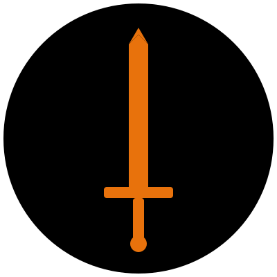

<div align="center">
  
  
  <h1>Keerthan's 3D Interactive Portfolio</h1>
  <p><strong>A cinematic, anime-inspired personal portfolio built with React, Three.js, and GSAP.</strong></p>
  
  <p>
    
    
    
    
    
  </p>
</div>

---

## 🌟 Overview

Welcome to my personal corner of the web! This portfolio is designed to be an immersive, storytelling experience rather than a traditional static website. Heavily inspired by anime aesthetics, it features custom 3D web rendering, complex scroll-linked animations, and a rich, dark UI.

## 🔥 Key Features

- **3D Interactive Elements:** Features a fully rendered 3D Sword (Katana) built with `@react-three/fiber` and `@react-three/drei` that interacts with the scrolling layout.
- **Cinematic Intro Sequence:** An engaging, timed anime-style intro sequence that transitions seamlessly into the main content.
- **Advanced Scroll Animations:** Utilizes **GSAP ScrollTrigger** to create a custom layered scrolling experience. The backgrounds slide like curtains behind a fixed 3D element, while the text content elegantly fades and utilizes parallax movement.
- **Responsive & Dynamic Design:** Built completely with **Tailwind CSS**, ensuring the cinematic experience scales perfectly from massive desktop monitors down to mobile screens.
- **Background Music Integration:** Immersive BGM controller built-in to complete the cinematic atmosphere.

## 🛠️ Technologies Used

- **Frontend Framework:** React 18
- **Build Tool:** Vite
- **Styling:** Tailwind CSS
- **3D Graphics:** Three.js, React Three Fiber
- **Animations:** GSAP (GreenSock Animation Platform), Framer Motion
- **Icons & Typography:** Lucide React, Google Fonts

## 🚀 Getting Started

If you want to run this project locally and explore the source code:

### Prerequisites
Make sure you have Node.js installed on your machine.

### Installation

1. **Clone the repository:**
   ```bash
   git clone <your-repo-url>
   cd portfolio2
   ```

2. **Install dependencies:**
   ```bash
   npm install
   ```

3. **Start the Development Server:**
   ```bash
   npm run dev
   ```
   Open `http://localhost:5173` in your browser to view the site.

## 📦 Building for Production

To create an optimized production build, run:
```bash
npm run build
```
This will generate a `dist` directory containing all the minified, production-ready assets which you can deploy to Vercel, Netlify, GitHub Pages, or any static hosting service.

## 🤝 Contact & Socials
Feel free to reach out to me for collaborations or just to say hi!

- **GitHub:** [KeethuKotian](https://github.com/KeethuKotian)
- **LinkedIn:** [Keerthan Kotian](https://www.linkedin.com/in/keerthan-k-966b11213/)
- **Email:** [keerthankotian05@gmial.com](keerthankotian05@gmial.com)

---
*Designed & Built by Keerthan Kotian*
